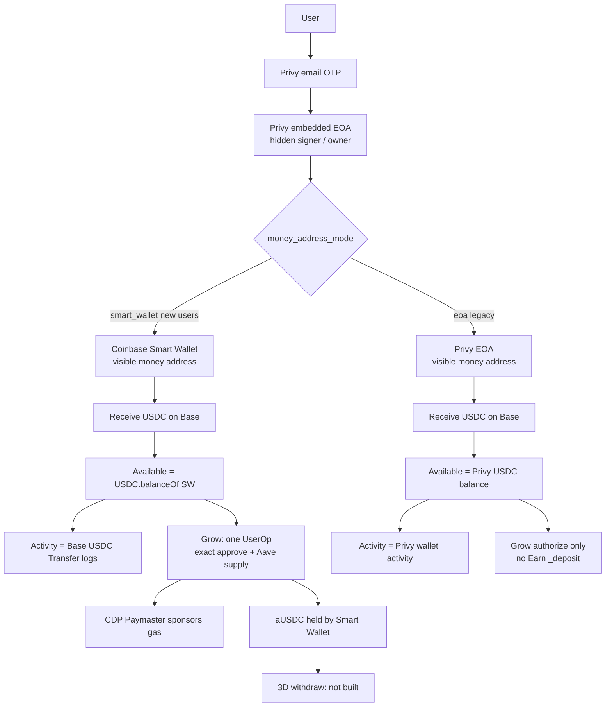

# Olimpia — Current Architecture

**Status:** Implemented architecture at commit `dac4cff`  
**Scope:** What the code does today, not the older planned V1 docs  
**This file is the source of truth** until later documentation is aligned to it

Older docs (`docs/V1Architecture.md`, `docs/architecture/Architecture.md`, and related product/build files) still describe an August 2026 Privy-EOA + Privy Earn plan. Do not implement from those documents when they conflict with this file.

---

## 1. Status

| Stage | Meaning | Status |
|-------|---------|--------|
| **3A** | Sponsored-gas proof (Coinbase Smart Wallet + Paymaster) | **Complete.** The Sepolia proof screen remains `__DEV__` only. Production Grow gas is Base Mainnet. |
| **3B** | Smart Wallet money layer (identity, Receive, Available, Activity) | **Complete** |
| **3C** | Smart Wallet → Aave Grow deposits with Coinbase-sponsored gas | **Complete** (implementation + live Base deposits). Execution is **gated OFF by default**. |
| **3D** | Withdraw from Grow back to Available | **Not built** |

Live Smart Wallet Grow deposits of $0.10 and $0.20 were confirmed on Base Mainnet. That proves the 3C path. It does not mean production execution is left on.

The Grow execution kill switch `AAVE_SMART_WALLET_DEPOSITS_ENABLED` **defaults to false**. Prepare is allowed while the flag is off. Submit, send, and confirm stop before any UserOperation is sent.

---

## 2. What the user has

Olimpia has **two money modes**. Mode is chosen once, on first wallet insert, and is **not flipped later**.

| Mode | Who | Visible money address | Hidden signer |
|------|-----|-----------------------|---------------|
| `smart_wallet` | New users who have a Privy-linked Coinbase Smart Wallet | Coinbase Smart Wallet | Privy embedded EOA |
| `eoa` | Legacy users, or a first insert with no Smart Wallet | Privy embedded EOA | The EOA itself |

`money_address_mode` is insert-only. Auth sync may later store a `smart_wallet_address` on an existing row, but it does **not** change `money_address_mode`. A legacy EOA user can have a stored Smart Wallet address and still use the EOA money path.

### Authentication

- Mobile uses Privy email OTP (`@privy-io/expo`).
- After login, mobile calls `POST /api/v1/auth/sync`. Returning sessions use `GET /api/v1/me`.
- The API verifies the Privy access token and loads the Privy user.
- Privy creates or restores the **embedded Ethereum EOA**.
- For users who also have a linked Coinbase Smart Wallet, the API stores that address separately and never treats it as the embedded EOA.

### Hidden EOA signer / owner

- The Privy embedded EOA is the Smart Wallet owner/signer.
- It is not shown as the Receive address for `smart_wallet` users.
- Seed phrases and private keys are not stored by Olimpia.
- Privy app secrets stay server-side.

### Coinbase Smart Wallet (new-user money account)

- New users with a linked Smart Wallet get `money_address_mode = smart_wallet`.
- The public wallet address returned by `/auth/sync` and `/me` is the Smart Wallet (`toPublicMoneyAddress`).
- Receive, Available, Activity, and Grow for those users all use that Smart Wallet.

---

## 3. Network and asset

| Item | Implemented value |
|------|-------------------|
| Network | Base Mainnet |
| Chain ID | `8453` |
| Asset | Native USDC |
| USDC | `0x833589fCD6eDb6E08f4c7C32D4f71b54bdA02913` |
| Aave V3 Pool | `0xA238Dd80C259a72e81d7e4664a9801593F98d1c5` |
| aUSDC | `0x4e65fE4DbA92790696d040ac24Aa414708F5c0AB` |

No other chain or asset is a current money path.

---

## 4. Receive

`ReceiveMoneyScreen` displays `authSync.wallet.address` from `/auth/sync` or `/me`.

| Mode | Address shown | Where inbound USDC must go |
|------|---------------|----------------------------|
| `smart_wallet` | Coinbase Smart Wallet | Directly to the Smart Wallet on Base |
| `eoa` | Privy embedded EOA | Directly to the EOA on Base |

There is no separate “credit the ledger, then show Available” step for Smart Wallet users. Available and Activity read chain state for that address.

Fiat **Add Money** / Coinbase Headless Onramp is **not** the current V1 funding path. That code is preserved and unmounted for post-V1. Do not treat it as how users fund today.

---

## 5. Available balance

`GET /api/v1/balance` and the balance on `/me` call `getHomeBalanceForWallet`.

| Mode | Read |
|------|------|
| `smart_wallet` | `USDC.balanceOf(smartWallet)` on Base (`getUsdcBalanceUsdOnBase`) |
| `eoa` | Privy server USDC balance for `privy_wallet_id` (`getHomeBalanceForPrivyWallet`) |

The backend ledger (`user_balances`) is **not** what Home Available shows for Smart Wallet users.

---

## 6. Activity

`GET /api/v1/activity` calls `getHomeActivityForWallet`.

| Mode | Read |
|------|------|
| `smart_wallet` | Base USDC `Transfer` logs for the Smart Wallet (`getUsdcActivityOnBase`) |
| `eoa` | Existing Privy wallet activity path (`getHomeActivityForPrivyWallet`) |

Smart Wallet activity is USDC transfers only. A Grow supply appears as USDC leaving the Smart Wallet. aUSDC mints are not a separate activity feed.

---

## 7. Grow

Product name: **Grow**. Protocol names stay out of primary UI.

### Smart Wallet Grow (current execution architecture)

Implemented for `money_address_mode = smart_wallet` only.

1. User enters an amount ≤ Available on Choose Yield.
2. Mobile prepares `POST /api/v1/growth/smart-wallet-deposits/prepare`.
3. Review shows the amount and **Start earning**.
4. If the kill switch is off, Start earning returns before `getClientForChain` / `sendTransaction`.
5. If the kill switch is on:
   - Client re-checks the plan (`assertExecutableAavePlan`).
   - One Coinbase Smart Wallet UserOperation is sent on Base.
   - That UserOperation contains exactly two calls:
     - USDC `approve` of the **exact** deposit amount to the Aave V3 Pool
     - Aave V3 `supply` of that same amount, `onBehalfOf` = the same Smart Wallet
   - Unlimited approval (`uint256 max`) is rejected by server and client.
   - Coinbase CDP Paymaster sponsors gas (Dashboard configuration only; no Paymaster URL or credential is in the repo or client).
   - After `sendTransaction` returns a hash, that hash is persisted, then the receipt is verified.
6. Grow balance for Smart Wallet users is the Smart Wallet’s **aUSDC** (`getGrowthForSmartWallet` → `aUSDC.balanceOf`).

EOA users cannot use this prepare / submit / send / confirm path (`requireSmartWalletAccount`).

### Retry-safe deposit model (3C.3)

Statuses: `prepared` → `submitted` → `confirmed`. `failed` is allowed only when `transaction_hash` is null.

| Rule | Behavior |
|------|----------|
| Persist hash first | Client stores the send hash, then `POST .../confirm` attaches it **before** receipt verification |
| Hashed `submitted` cannot send again | Retry confirms the same hash only. Prepare will not replace an open `submitted` row |
| Same hash only | A different replacement hash is rejected |
| `/fail` | Rejects a row that already has a hash |
| Receipt not ready / mismatch | Stays `submitted`; confirm returns 409 “still confirming”; does not mark failed |
| Client retry | If a hash is already in memory, Start earning calls confirm only |

### Legacy EOA Grow (not Smart Wallet execution)

- EOA users still have the authorize-only path: `POST /api/v1/growth/deposit-authorizations` and `.../confirm`.
- Smart Wallet users are refused on that path (“Smart Wallet Grow uses a different deposit path”).
- **No Privy Earn `_deposit` execution exists.**
- **No Privy Earn `_withdraw` execution exists.**
- Privy Earn is not the Smart Wallet Grow architecture.
- EOA Grow reads may still use Privy Earn position/metadata. That is a legacy read/authorize path, not current Smart Wallet execution.

### Grow withdrawal (3D)

**Not built.** There is no Smart Wallet withdraw route and no Earn withdraw execution. Do not document withdrawal as complete.

---

## 8. Gas

| Item | Implemented |
|------|-------------|
| Grow gas (Smart Wallet, Base) | Coinbase CDP Paymaster sponsorship |
| Who pays Grow gas | Coinbase Paymaster, not Privy, and not the user’s ETH |
| Where Paymaster is configured | Coinbase Developer Platform Dashboard only |
| In repo / client | No Paymaster URL, secret, or credential |

The 3A Sepolia sponsorship screen is `__DEV__` only and is not the production Grow path.

---

## 9. Kill switch

`AAVE_SMART_WALLET_DEPOSITS_ENABLED` is parsed with default **false** (`apps/api/src/config/env.ts`).

| Flag | Prepare | Submit / send / confirm |
|------|---------|-------------------------|
| `false` (default) | Allowed | Blocked before any UserOperation |
| `true` | Allowed | Smart Wallet Aave deposit may send |

Do not put a Paymaster URL in this variable or in any client env.

---

## 10. What is not current architecture

| Topic | Status |
|-------|--------|
| Coinbase Headless Add Money / Apple Pay | Preserved in repo, **not** V1 funding, not mounted in the live tab shell |
| Fiat offramp / bank withdrawal | Not selected, not built |
| Bridge.xyz / Dakota | Not active |
| Gnosis Pay / card spend | Not implemented |
| Privy Earn as Smart Wallet Grow execution | Incorrect. Do not use. |
| Ledger as Smart Wallet Available/Activity truth | Incorrect. Those reads are on-chain. |
| Sepolia as production money/gas architecture | Incorrect. Production money path is Base Mainnet. |
| Grow withdrawal | **Not built** |

---

## 11. Architecture flow

---

## 12. Code entrypoints

### Identity and mode

| File | Role |
|------|------|
| `apps/api/src/auth/privy.ts` | Token verify; `extractSmartWalletIdentity` |
| `apps/api/src/services/moneyAddress.ts` | `resolveInsertMoneyAddressMode`, `toPublicMoneyAddress` |
| `apps/api/src/services/authSync.ts` | Persist wallet; insert-only `money_address_mode`; public address |
| `apps/api/migrations/007_wallet_smart_account_identity.sql` | `smart_wallet_address`, `smart_wallet_type`, `money_address_mode` |

### Receive, Available, Activity, Grow reads

| File | Role |
|------|------|
| `apps/mobile/src/screens/ReceiveMoneyScreen.tsx` | Shows public money address |
| `apps/mobile/src/components/AuthenticatedTabShell.tsx` | Passes `/me` address into Receive / Grow |
| `apps/api/src/services/walletBalance.ts` | Mode split for Available |
| `apps/api/src/services/usdcBalance.ts` | Base USDC `balanceOf` |
| `apps/api/src/services/privyBalance.ts` | Legacy EOA Privy balance |
| `apps/api/src/services/walletActivity.ts` | Mode split for Activity |
| `apps/api/src/services/usdcActivity.ts` | Base USDC Transfer logs |
| `apps/api/src/services/privyActivity.ts` | Legacy EOA Privy activity |
| `apps/api/src/services/walletGrowth.ts` | Mode split for Grow summary |
| `apps/api/src/services/aaveGrowth.ts` | Smart Wallet aUSDC read |
| `apps/api/src/services/privyGrowth.ts` | Legacy EOA Grow read / metadata |

### Smart Wallet Grow execution

| File | Role |
|------|------|
| `apps/api/src/services/aaveAddresses.ts` | Base USDC, Aave Pool, aUSDC, chain ID |
| `apps/api/src/services/aaveDepositPlan.ts` | Exact approve + supply; reject unlimited approval |
| `apps/api/src/services/aaveDepositExecution.ts` | Kill switch; attach-then-verify receipt rules |
| `apps/api/src/services/aaveDepositStore.ts` | `prepared` / `submitted` / `confirmed` / `failed`; hash attach; fail only if hash is null |
| `apps/api/src/routes/v1/growth.ts` | Prepare, submit, fail, confirm; EOA vs Smart Wallet gates |
| `apps/api/migrations/008_smart_wallet_deposits.sql` | Deposit rows |
| `apps/mobile/src/screens/ChooseYieldScreen.tsx` | Enter / Review / You’re earning; confirm-only retry |
| `apps/mobile/src/services/aavePlanGuard.ts` | Client send guards |
| `apps/mobile/src/services/api/growth.ts` | Prepare / submit / confirm / fail clients |
| `apps/mobile/App.tsx` | `SmartWalletsProvider` |
| `apps/api/src/config/env.ts` | `aaveSmartWalletDepositsEnabled` default `false` |

### Legacy EOA authorize (frozen execution)

| File | Role |
|------|------|
| `apps/api/src/services/privyGrowthAuthorization.ts` | Authorize-only; refuses Smart Wallet users; no `_deposit` / `_withdraw` |
| `apps/api/migrations/006_growth_deposit_authorizations.sql` | Authorization rows |

### 3A leftover (not production Grow)

| File | Role |
|------|------|
| `apps/mobile/src/screens/SepoliaSponsorshipProofScreen.tsx` | `__DEV__` sponsored-gas proof only |

---

## 13. Security notes for later docs

- Do not document Paymaster URLs.
- Do not copy `.env.local` values, API keys, tokens, or CDP credentials into documentation.
- Server secrets stay in `apps/api` env, never in the mobile bundle.
- `BASE_RPC_URL` is a read RPC, not a Paymaster URL.

---

*End of Current Architecture (`dac4cff`)*
