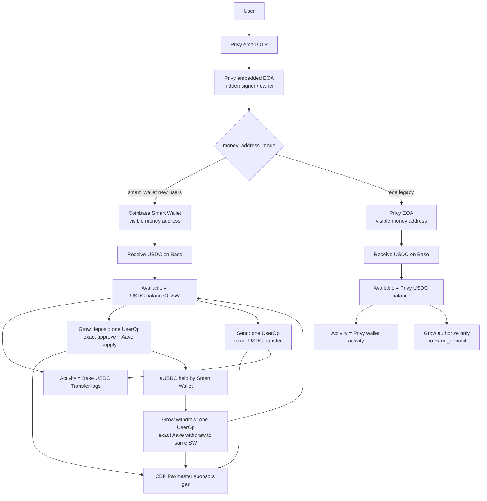

# Olimpia — Current Architecture

**Status:** Implemented architecture through commit `52375f1`  
**Scope:** What the code does today, not the older planned V1 docs  
**This file is the source of truth** until later documentation is aligned to it

Older docs (`docs/V1Architecture.md`, `docs/architecture/Architecture.md`, and related product/build files) still describe an August 2026 Privy-EOA + Privy Earn plan. Do not implement from those documents when they conflict with this file.

---

## 1. Status

| Stage | Meaning | Status |
|-------|---------|--------|
| **3A** | Sponsored-gas proof (Coinbase Smart Wallet + Paymaster) | ✅ **Complete.** The Sepolia proof screen remains `__DEV__` only. Production Grow gas is Base Mainnet. |
| **3B** | Smart Wallet money layer (identity, Receive, Available, Activity) | ✅ **Complete** |
| **3C** | Smart Wallet → Aave Grow deposits with Coinbase-sponsored gas | ✅ **Complete** (implementation + live Base deposits). Execution is **gated OFF by default**. |
| **3D** | Withdraw from Grow back to Available | ✅ **Complete** (implementation + live Base withdrawal). Execution is **gated OFF by default**. |
| **3E** | Smart Wallet Send (Available USDC → any valid Base address) | ✅ **Implemented.** Live transaction test is **deferred**. Execution is **gated OFF by default**. |

Live Smart Wallet Grow deposits of $0.10 and $0.20 were confirmed on Base Mainnet. That proves the 3C path. It does not mean production execution is left on.

A controlled Smart Wallet Grow withdrawal of exactly $0.10 USDC was confirmed on Base Mainnet on **September 30, 2026**. That proves the 3D path. It does not mean production execution is left on.

**No live Stage 3E Send transaction has been executed yet.** Implementation and API tests are complete. Physical-device native Paste verification is a pre-release check. The iOS 27 Device Hub simulator pasteboard is broken and is not a reason to change the Send field.

All three money-movement kill switches **default to false** and are currently **OFF**:

- `AAVE_SMART_WALLET_DEPOSITS_ENABLED`
- `AAVE_SMART_WALLET_WITHDRAWALS_ENABLED`
- `SMART_WALLET_SENDS_ENABLED`

Prepare is allowed while a flag is off. Submit, send, and confirm stop before any UserOperation is sent. After the 3D live verification, both Grow flags were returned to **OFF**. After the paused 3E live-test prep, the Send flag was returned to **OFF**.

---

## 2. What the user has

Olimpia has **two money modes**. Mode is chosen once, on first wallet insert, and is **not flipped later**.

| Mode | Who | Visible money address | Hidden signer |
|------|-----|-----------------------|---------------|
| `smart_wallet` | New users who have a Privy-linked Coinbase Smart Wallet | Coinbase Smart Wallet | Privy embedded EOA |
| `eoa` | Legacy users, or a first insert with no Smart Wallet | Privy embedded EOA | The EOA itself |

`money_address_mode` is insert-only. Auth sync may later store a `smart_wallet_address` on an existing row, but it does **not** change `money_address_mode`. A legacy EOA user can have a stored Smart Wallet address and still use the EOA money path.

### Authentication

- Mobile uses Privy email OTP (`@privy-io/expo`).
- After login, mobile calls `POST /api/v1/auth/sync`. Returning sessions use `GET /api/v1/me`.
- The API verifies the Privy access token and loads the Privy user.
- Privy creates or restores the **embedded Ethereum EOA**.
- For users who also have a linked Coinbase Smart Wallet, the API stores that address separately and never treats it as the embedded EOA.

### Hidden EOA signer / owner

- The Privy embedded EOA is the Smart Wallet owner/signer.
- It is not shown as the Receive address for `smart_wallet` users.
- Seed phrases and private keys are not stored by Olimpia.
- Privy app secrets stay server-side.

### Coinbase Smart Wallet (new-user money account)

- New users with a linked Smart Wallet get `money_address_mode = smart_wallet`.
- The public wallet address returned by `/auth/sync` and `/me` is the Smart Wallet (`toPublicMoneyAddress`).
- Receive, Available, Activity, Grow, and Send for those users all use that Smart Wallet. The hidden Privy EOA is never the Send sender.

---

## 3. Network and asset

| Item | Implemented value |
|------|-------------------|
| Network | Base Mainnet |
| Chain ID | `8453` |
| Asset | Native USDC |
| USDC | `0x833589fCD6eDb6E08f4c7C32D4f71b54bdA02913` |
| Aave V3 Pool | `0xA238Dd80C259a72e81d7e4664a9801593F98d1c5` |
| aUSDC | `0x4e65fE4DbA92790696d040ac24Aa414708F5c0AB` |

No other chain or asset is a current money path.

---

## 4. Receive

`ReceiveMoneyScreen` displays `authSync.wallet.address` from `/auth/sync` or `/me`.

| Mode | Address shown | Where inbound USDC must go |
|------|---------------|----------------------------|
| `smart_wallet` | Coinbase Smart Wallet | Directly to the Smart Wallet on Base |
| `eoa` | Privy embedded EOA | Directly to the EOA on Base |

There is no separate “credit the ledger, then show Available” step for Smart Wallet users. Available and Activity read chain state for that address.

Fiat **Add Money** / Coinbase Headless Onramp is **not** the current V1 funding path. That code is preserved and unmounted for post-V1. Do not treat it as how users fund today.

---

## 5. Available balance

`GET /api/v1/balance` and the balance on `/me` call `getHomeBalanceForWallet`.

| Mode | Read |
|------|------|
| `smart_wallet` | `USDC.balanceOf(smartWallet)` on Base (`getUsdcBalanceUsdOnBase`) |
| `eoa` | Privy server USDC balance for `privy_wallet_id` (`getHomeBalanceForPrivyWallet`) |

The backend ledger (`user_balances`) is **not** what Home Available shows for Smart Wallet users.

---

## 6. Activity

`GET /api/v1/activity` calls `getHomeActivityForWallet`.

| Mode | Read |
|------|------|
| `smart_wallet` | Base USDC `Transfer` logs for the Smart Wallet (`getUsdcActivityOnBase`) |
| `eoa` | Existing Privy wallet activity path (`getHomeActivityForPrivyWallet`) |

Smart Wallet activity is USDC transfers only. A Grow supply appears as USDC leaving the Smart Wallet. A Grow withdraw appears as USDC returning to the Smart Wallet. A Smart Wallet Send appears as USDC leaving the Smart Wallet to the destination. aUSDC mints and burns are not a separate activity feed. No extra Activity wiring is required for Send.

---

## 7. Grow

Product name: **Grow**. Protocol names stay out of primary UI.

### Smart Wallet Grow (current execution architecture)

Implemented for `money_address_mode = smart_wallet` only.

1. User enters an amount ≤ Available on Choose Yield.
2. Mobile prepares `POST /api/v1/growth/smart-wallet-deposits/prepare`.
3. Review shows the amount and **Start earning**.
4. If the kill switch is off, Start earning returns before `getClientForChain` / `sendTransaction`.
5. If the kill switch is on:
   - Client re-checks the plan (`assertExecutableAavePlan`).
   - One Coinbase Smart Wallet UserOperation is sent on Base.
   - That UserOperation contains exactly two calls:
     - USDC `approve` of the **exact** deposit amount to the Aave V3 Pool
     - Aave V3 `supply` of that same amount, `onBehalfOf` = the same Smart Wallet
   - Unlimited approval (`uint256 max`) is rejected by server and client.
   - Coinbase CDP Paymaster sponsors gas (Dashboard configuration only; no Paymaster URL or credential is in the repo or client).
   - After `sendTransaction` returns a hash, that hash is persisted, then the receipt is verified.
6. Grow balance for Smart Wallet users is the Smart Wallet’s **aUSDC** (`getGrowthForSmartWallet` → `aUSDC.balanceOf`).

EOA users cannot use this prepare / submit / send / confirm path (`requireSmartWalletAccount`).

### Retry-safe deposit model (3C.3)

Statuses: `prepared` → `submitted` → `confirmed`. `failed` is allowed only when `transaction_hash` is null.

| Rule | Behavior |
|------|----------|
| Persist hash first | Client stores the send hash, then `POST .../confirm` attaches it **before** receipt verification |
| Hashed `submitted` cannot send again | Retry confirms the same hash only. Prepare will not replace an open `submitted` row |
| Same hash only | A different replacement hash is rejected |
| `/fail` | Rejects a row that already has a hash |
| Receipt not ready / mismatch | Stays `submitted`; confirm returns 409 “still confirming”; does not mark failed |
| Client retry | If a hash is already in memory, Start earning calls confirm only |

### Legacy EOA Grow (not Smart Wallet execution)

- EOA users still have the authorize-only path: `POST /api/v1/growth/deposit-authorizations` and `.../confirm`.
- Smart Wallet users are refused on that path (“Smart Wallet Grow uses a different deposit path”).
- **No Privy Earn `_deposit` execution exists.**
- **No Privy Earn `_withdraw` execution exists.**
- Privy Earn is not the Smart Wallet Grow architecture.
- EOA Grow reads may still use Privy Earn position/metadata. That is a legacy read/authorize path, not current Smart Wallet execution.

### Smart Wallet Grow withdrawal (3D)

Implemented for `money_address_mode = smart_wallet` only.

Flow: **Olimpia Grow / Aave → Coinbase Smart Wallet → Available USDC**.

1. User chooses an exact amount ≤ Grow (aUSDC) on Home → Withdraw.
2. Mobile prepares `POST /api/v1/growth/smart-wallet-withdrawals/prepare`.
3. If the withdrawal kill switch is off, Confirm returns before `getClientForChain` / `sendTransaction`.
4. If the withdrawal kill switch is on:
   - Client re-checks the plan (`assertExecutableAaveWithdrawPlan`).
   - `POST .../sending` sets `send_attempted_at` **before** broadcast.
   - One Coinbase Smart Wallet UserOperation is sent on Base (`sendTransaction` once).
   - That UserOperation contains exactly one call:
     - Aave V3 Base Pool `withdraw(address,uint256,address)` of the **exact** amount
     - `to` / destination = the same Coinbase Smart Wallet
   - No ERC-20 `approve` is required for withdraw.
   - `uint256.max` is rejected by server and client.
   - Coinbase CDP Paymaster sponsors gas (Dashboard configuration only; no Paymaster URL or credential is in the repo or client).
   - After `sendTransaction` returns a hash, that hash is persisted, then the receipt is verified.
5. Available increases by the withdrawn USDC. Grow is the remaining Smart Wallet **aUSDC**.

EOA users cannot use this prepare / submit / sending / send / confirm path (`requireSmartWalletAccount`).

**No Privy Earn `_withdraw` execution exists.** Privy Earn is not the Smart Wallet Grow withdrawal architecture.

### Retry-safe withdrawal model (3D)

Statuses: `prepared` → `submitted` → `confirmed`. `failed` is allowed only when `transaction_hash` is null **and** `send_attempted_at` is null.

| Rule | Behavior |
|------|----------|
| Send-attempt lock | `POST .../sending` sets `send_attempted_at` before `sendTransaction`. An uncertain send is not automatically resent |
| Persist hash first | Client stores the send hash, then `POST .../confirm` attaches it **before** receipt verification |
| Known hash is confirm-only | If a hash is already in memory, retry confirms that hash only. It does not send again |
| Hashed `submitted` cannot send again | Prepare will not replace an open `submitted` row |
| Same hash only | A different replacement hash is rejected |
| `/fail` | Rejects a row that already has a hash, or a row with `send_attempted_at` set |
| Receipt not ready / mismatch | Stays `submitted`; confirm returns 409 “still confirming”; does not mark failed |

### Deposit / withdrawal / Send cross-lock

Prepare refuses if another money-movement path already has a `submitted` row for that user.

- A submitted deposit blocks preparing a withdrawal or a Send.
- A submitted withdrawal blocks preparing a deposit or a Send.
- A submitted Send blocks preparing a deposit or a withdrawal.

### September 30, 2026 controlled Base Mainnet verification

Live-verified on Base Mainnet. After this test, both kill switches were returned to **OFF**.

| Item | Result |
|------|--------|
| Amount | Exactly **$0.10 USDC** (`100000` USDC units) withdrawn from Grow |
| Available | **$0.70 → $0.80** |
| Grow / aUSDC | Approximately **$0.300157 → $0.200157** |
| Receipt | Succeeded |
| Aave V3 `Withdraw` event | Verified; destination = the Coinbase Smart Wallet |
| Gas | Coinbase Paymaster sponsored; Smart Wallet paid no ETH gas |
| Original Privy EOA | Not involved; remaining USDC / ETH untouched |
| Transaction hash | `0xa81e25911a43d1456418c2b07d16df433df2aa06d1da2ecd658b6afe8a27b62f` |

---

## 8. Send

Product name: **Send**. Implemented for `money_address_mode = smart_wallet` only.

**Status:** Implemented at commit `52375f1`. **No live Stage 3E Send transaction has been executed yet.** The live test is deferred. Execution remains gated **OFF**.

Flow: **Available USDC on the Coinbase Smart Wallet → any valid Base wallet address**.

Send uses **Available USDC only**. It never spends Grow / aUSDC. Amount cannot exceed `USDC.balanceOf(smartWallet)`. Destinations that are the same Smart Wallet, the zero address, Base USDC, aUSDC, or the Aave V3 Pool are rejected. `uint256.max` is rejected.

1. Smart Wallet users can open Send even with $0 Available. The Send button stays disabled until the amount is valid and ≤ Available. EOA users cannot execute this path.
2. Mobile prepares `POST /api/v1/sends/prepare`.
3. Same-screen states: **Send → Confirm Send → Sending → Sent**.
4. Confirm Send shows the amount and a shortened destination. Sending holds an execution lock against duplicate taps.
5. If the Send kill switch is off, Confirm returns before `getClientForChain` / `sendTransaction`.
6. If the Send kill switch is on:
   - Client re-checks the plan (`assertExecutableUsdcSendPlan`).
   - `POST /api/v1/sends/:id/sending` sets `send_attempted_at` **before** broadcast.
   - One Coinbase Smart Wallet UserOperation is sent on Base (`sendTransaction` once).
   - That UserOperation contains exactly one call:
     - Official Base USDC `transfer(address,uint256)` of the **exact** entered amount
     - `to` = Base USDC `0x833589fCD6eDb6E08f4c7C32D4f71b54bdA02913`
     - Native value = `0`
   - Chain is Base Mainnet, chain ID `8453`.
   - The sender is the Coinbase Smart Wallet. The hidden Privy EOA is never the sender.
   - Coinbase CDP Paymaster sponsors gas (Dashboard configuration only; no Paymaster URL or credential is in the repo or client).
   - After `sendTransaction` returns a hash, that hash is persisted, then the receipt is verified (USDC `Transfer` from the Smart Wallet to the destination for the exact amount).
7. Sent shows amount sent, shortened destination, transaction hash, and **View Transaction on BaseScan**. Done closes Send and refreshes Home Available and Activity.

EOA users cannot use this prepare / submit / sending / send / confirm path (`requireSmartWalletAccount`).

Outgoing Send USDC is a normal Base USDC `Transfer` from the Smart Wallet, so it appears in existing Smart Wallet Activity with no extra feed.

### QR and Paste

- **Scan QR** uses `expo-camera` and parses a Base wallet address (bare `0x`, `ethereum:`, `eip155:8453:`). Paste / manual entry remains available if camera permission is denied or the camera native module is missing.
- The wallet-address field is a normal iOS `TextInput` (`textContentType="none"`, `autoComplete="off"`). The intended product paste path is the native long-press **Paste** menu.
- Physical-device native Paste verification remains a **pre-release check**. The iOS 27 Device Hub simulator pasteboard is broken (`simctl pbcopy` reports success but the device pasteboard stays empty). Do not change the Send field to work around that host bug.

### Retry-safe Send model (3E)

Statuses: `prepared` → `submitted` → `confirmed`. `failed` is allowed only when `transaction_hash` is null **and** `send_attempted_at` is null.

| Rule | Behavior |
|------|----------|
| Send-attempt lock | `POST .../sending` sets `send_attempted_at` before `sendTransaction`. An uncertain send is not automatically resent |
| Persist hash first | Client stores the send hash, then `POST .../confirm` attaches it **before** receipt verification |
| Known hash is confirm-only | If a hash is already in memory, retry confirms that hash only. It does not send again |
| Hashed `submitted` cannot send again | Prepare will not replace an open `submitted` row |
| Same hash only | A different replacement hash is rejected |
| `/fail` | Rejects a row that already has a hash, or a row with `send_attempted_at` set |
| Receipt not ready / mismatch | Stays `submitted`; confirm returns 409 “still confirming”; does not mark failed |

---

## 9. Gas

| Item | Implemented |
|------|-------------|
| Grow deposit, Grow withdrawal, and Send gas (Smart Wallet, Base) | Coinbase CDP Paymaster sponsorship |
| Who pays that gas | Coinbase Paymaster, not Privy, and not the user’s ETH |
| Where Paymaster is configured | Coinbase Developer Platform Dashboard only |
| CDP Base Mainnet allowlist | USDC `approve(address,uint256)` and USDC `transfer(address,uint256)`. Aave Pool configuration is unchanged |
| In repo / client | No Paymaster URL, secret, or credential |

The 3A Sepolia sponsorship screen is `__DEV__` only and is not the production Grow or Send path.

---

## 10. Kill switches

All three flags are parsed with default **false** (`apps/api/src/config/env.ts`). They are independent. All three are currently **OFF**.

| Flag | Default | Prepare | Submit / send / confirm |
|------|---------|---------|-------------------------|
| `AAVE_SMART_WALLET_DEPOSITS_ENABLED` | `false` | Allowed | Deposit UserOperation blocked unless `true` |
| `AAVE_SMART_WALLET_WITHDRAWALS_ENABLED` | `false` | Allowed | Withdrawal UserOperation blocked unless `true` |
| `SMART_WALLET_SENDS_ENABLED` | `false` | Allowed | Send UserOperation blocked unless `true` |

Do not put a Paymaster URL in these variables or in any client env. After the September 30, 2026 live withdrawal, both Grow flags were returned to **OFF**. After the paused 3E live-test prep, `SMART_WALLET_SENDS_ENABLED` was returned to **OFF**.

---

## 11. What is not current architecture

| Topic | Status |
|-------|--------|
| Coinbase Headless Add Money / Apple Pay | Preserved in repo, **not** V1 funding, not mounted in the live tab shell |
| Fiat offramp / bank withdrawal | Not selected, not built |
| Bridge.xyz / Dakota | Not active |
| Gnosis Pay / card spend | Not implemented |
| Privy Earn as Smart Wallet Grow execution | Incorrect. Do not use. |
| Ledger as Smart Wallet Available/Activity truth | Incorrect. Those reads are on-chain. |
| Sepolia as production money/gas architecture | Incorrect. Production money path is Base Mainnet. |
| Grow withdrawal (3D) | **Built** for Smart Wallet users. Live-verified on Base. Execution remains **gated OFF by default**. |
| Smart Wallet Send (3E) | **Built** for Smart Wallet users. **No live Send transaction yet.** Execution remains **gated OFF by default**. Physical-device native Paste is a pre-release check. |

---

## 12. Architecture flow

```mermaid
flowchart TD
  user[User] --> privyAuth[Privy email OTP]
  privyAuth --> eoa[Privy embedded EOA<br/>hidden signer / owner]
  eoa --> mode{money_address_mode}

  mode -->|smart_wallet new users| sw[Coinbase Smart Wallet<br/>visible money address]
  mode -->|eoa legacy| eoaMoney[Privy EOA<br/>visible money address]

  sw --> receiveSW[Receive USDC on Base]
  receiveSW --> availSW[Available = USDC.balanceOf SW]
  availSW --> actSW[Activity = Base USDC Transfer logs]
  availSW --> growSW[Grow deposit: one UserOp<br/>exact approve + Aave supply]
  availSW --> sendSW[Send: one UserOp<br/>exact USDC transfer]
  growSW --> paymaster[CDP Paymaster sponsors gas]
  sendSW --> paymaster
  sendSW --> actSW
  growSW --> ausdc[aUSDC held by Smart Wallet]
  ausdc --> withdrawSW[Grow withdraw: one UserOp<br/>exact Aave withdraw to same SW]
  withdrawSW --> paymaster
  withdrawSW --> availSW

  eoaMoney --> receiveEOA[Receive USDC on Base]
  receiveEOA --> availEOA[Available = Privy USDC balance]
  availEOA --> actEOA[Activity = Privy wallet activity]
  availEOA --> authEOA[Grow authorize only<br/>no Earn _deposit]
```

---

## 13. Code entrypoints

### Identity and mode

| File | Role |
|------|------|
| `apps/api/src/auth/privy.ts` | Token verify; `extractSmartWalletIdentity` |
| `apps/api/src/services/moneyAddress.ts` | `resolveInsertMoneyAddressMode`, `toPublicMoneyAddress` |
| `apps/api/src/services/authSync.ts` | Persist wallet; insert-only `money_address_mode`; public address |
| `apps/api/migrations/007_wallet_smart_account_identity.sql` | `smart_wallet_address`, `smart_wallet_type`, `money_address_mode` |

### Receive, Available, Activity, Grow reads

| File | Role |
|------|------|
| `apps/mobile/src/screens/ReceiveMoneyScreen.tsx` | Shows public money address |
| `apps/mobile/src/components/AuthenticatedTabShell.tsx` | Passes `/me` address into Receive / Grow / Send |
| `apps/api/src/services/walletBalance.ts` | Mode split for Available |
| `apps/api/src/services/usdcBalance.ts` | Base USDC `balanceOf` |
| `apps/api/src/services/privyBalance.ts` | Legacy EOA Privy balance |
| `apps/api/src/services/walletActivity.ts` | Mode split for Activity |
| `apps/api/src/services/usdcActivity.ts` | Base USDC Transfer logs |
| `apps/api/src/services/privyActivity.ts` | Legacy EOA Privy activity |
| `apps/api/src/services/walletGrowth.ts` | Mode split for Grow summary |
| `apps/api/src/services/aaveGrowth.ts` | Smart Wallet aUSDC read |
| `apps/api/src/services/privyGrowth.ts` | Legacy EOA Grow read / metadata |

### Smart Wallet Grow execution

| File | Role |
|------|------|
| `apps/api/src/services/aaveAddresses.ts` | Base USDC, Aave Pool, aUSDC, chain ID |
| `apps/api/src/services/aaveDepositPlan.ts` | Exact approve + supply; reject unlimited approval |
| `apps/api/src/services/aaveDepositExecution.ts` | Kill switch; attach-then-verify receipt rules |
| `apps/api/src/services/aaveDepositStore.ts` | `prepared` / `submitted` / `confirmed` / `failed`; hash attach; fail only if hash is null |
| `apps/api/src/routes/v1/growth.ts` | Prepare, submit, fail, confirm; EOA vs Smart Wallet gates |
| `apps/api/migrations/008_smart_wallet_deposits.sql` | Deposit rows |
| `apps/mobile/src/screens/ChooseYieldScreen.tsx` | Enter / Review / You’re earning; confirm-only retry |
| `apps/mobile/src/services/aavePlanGuard.ts` | Client send guards |
| `apps/mobile/src/services/api/growth.ts` | Prepare / submit / confirm / fail clients |
| `apps/mobile/App.tsx` | `SmartWalletsProvider` |
| `apps/api/src/config/env.ts` | Deposit, withdrawal, and Send kill switches default `false` |

### Smart Wallet Grow withdrawal

| File | Role |
|------|------|
| `apps/api/src/services/aaveWithdrawPlan.ts` | Exact Pool `withdraw`; reject `uint256.max`; destination must be the same Smart Wallet |
| `apps/api/src/services/aaveWithdrawExecution.ts` | Withdrawal kill switch; attach-then-verify receipt rules |
| `apps/api/src/services/aaveWithdrawStore.ts` | `prepared` / `submitted` / `confirmed` / `failed`; hash attach; `send_attempted_at`; fail only if hash and send-attempt are both null |
| `apps/api/src/routes/v1/growth.ts` | Withdraw prepare, submit, sending, fail, confirm; deposit / withdrawal / Send cross-lock |
| `apps/api/migrations/009_smart_wallet_withdrawals.sql` | Withdrawal rows |
| `apps/api/migrations/010_smart_wallet_withdrawals_send_attempted.sql` | `send_attempted_at` |
| `apps/mobile/src/components/WithdrawSheet.tsx` | Amount / Processing / Done; confirm-only retry |
| `apps/mobile/src/services/aaveWithdrawExecution.ts` | Send-attempt lock; one `sendTransaction`; confirm-only if hash is known |
| `apps/mobile/src/services/aaveWithdrawPlanGuard.ts` | Client send guards |
| `apps/mobile/src/services/api/growth.ts` | Withdraw prepare / submit / sending / confirm / fail clients |

### Smart Wallet Send

| File | Role |
|------|------|
| `apps/api/src/services/usdcSendPlan.ts` | Exact USDC `transfer`; reject self, protocol, zero, `uint256.max`, over-Available |
| `apps/api/src/services/usdcSendExecution.ts` | Send kill switch; attach-then-verify receipt rules |
| `apps/api/src/services/usdcSendStore.ts` | `prepared` / `submitted` / `confirmed` / `failed`; hash attach; `send_attempted_at`; fail only if hash and send-attempt are both null |
| `apps/api/src/routes/v1/sends.ts` | Prepare, submit, sending, fail, confirm |
| `apps/api/migrations/011_smart_wallet_sends.sql` | Send rows + `send_attempted_at` from day one |
| `apps/mobile/src/screens/SendMoneyScreen.tsx` | Send / Confirm Send / Sending / Sent; Scan QR; native address field |
| `apps/mobile/src/services/usdcSendExecution.ts` | Send-attempt lock; one `sendTransaction`; confirm-only if hash is known |
| `apps/mobile/src/services/usdcSendPlanGuard.ts` | Client send guards |
| `apps/mobile/src/services/usdcSendQr.ts` | Parse pasted or scanned Base addresses |
| `apps/mobile/src/services/api/sends.ts` | Prepare / submit / sending / confirm clients |

### Legacy EOA authorize (frozen execution)

| File | Role |
|------|------|
| `apps/api/src/services/privyGrowthAuthorization.ts` | Authorize-only; refuses Smart Wallet users; no `_deposit` / `_withdraw` |
| `apps/api/migrations/006_growth_deposit_authorizations.sql` | Authorization rows |

### 3A leftover (not production Grow)

| File | Role |
|------|------|
| `apps/mobile/src/screens/SepoliaSponsorshipProofScreen.tsx` | `__DEV__` sponsored-gas proof only |

---

## 14. Security notes for later docs

- Do not document Paymaster URLs.
- Do not copy `.env.local` values, API keys, tokens, or CDP credentials into documentation.
- Server secrets stay in `apps/api` env, never in the mobile bundle.
- `BASE_RPC_URL` is a read RPC, not a Paymaster URL.

---

*End of Current Architecture (`52375f1`)*
