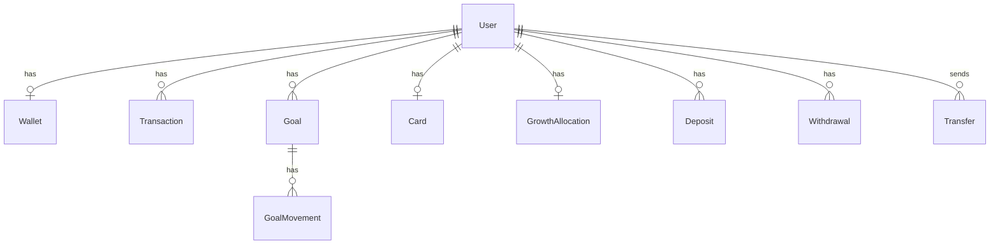

# Olimpia — Database Schema (Planning)

**Status:** Planning document for implementation  
**Audience:** Founder, developers, Cursor agents  
**Source of truth:** [PRD.md](./product/PRD.md) · [Architecture.md](./architecture/Architecture.md) · [BuildPlan.md](./build/BuildPlan.md)

---

## What this file is for

This document explains **what information Olimpia stores**, **why it exists**, and **how the pieces connect**. It is written in plain English so you can review it without being a database expert. A developer (or Cursor) can use it later to create PostgreSQL tables and migrations.

**This is not app code.** It is a planning map only.

---

## MVP scope reminder

### In MVP (database needed)

- User accounts and invisible wallets (Privy)
- Balances, transactions, and activity history
- Add money (Bridge on-ramp) and withdraw to bank (Bridge off-ramp)
- Send and receive money (Olimpia users only)
- Savings goals (logical envelopes)
- Growth account (USDC yield via **Aave first**)
- Virtual debit card (Gnosis Pay)
- Provider webhook logs (idempotency)
- Marketing waitlist emails

### Out of MVP (do not build yet)

- **Pia AI coach** — no `pia_threads` or `pia_messages` tables in MVP
- Request money, multi-provider yield routing, physical card, push notifications
- Full admin dashboard

> **Note:** Older Architecture drafts list Pia as MVP. **This engineering plan treats Pia as Future only** per founder correction. Marketing may show a **static Pia preview** on the website — that uses no coach database.

---

## Two databases today (honest picture)

Olimpia does not have one unified database yet. That is normal at this stage.

| Part | Where it lives | Status today | MVP role |
|------|----------------|--------------|----------|
| **Marketing waitlist** | Supabase (`waitlist_emails`) | **Live** — see [waitlist_emails.sql](../apps/marketing/supabase/waitlist_emails.sql) | Capture emails from the marketing site |
| **App data** | PostgreSQL (main app database) | **Not built yet** | Everything the mobile app and API need |

### Waitlist: two possible paths (TBD)

Architecture describes `POST /api/v1/waitlist` storing a `WaitlistEntry` in the main PostgreSQL database. **Today**, the marketing site writes directly to Supabase from the browser.

| Option | MVP approach | Future |
|--------|--------------|--------|
| **A (current)** | Keep Supabase waitlist table | Optionally sync or migrate to main DB |
| **B** | Marketing calls API waitlist endpoint | Single PostgreSQL database for everything |

**Decision: TBD.** MVP can ship with Option A while the API database is being built.

---

## How balances work (plain English)

Users see **dollars**, not crypto. The backend tracks three buckets:

```
Total balance (what the user sees)
├── Available — spend, send, withdraw, card
├── Savings goals — money set aside for named goals
└── Growth account — money earning optional yield
```

**Rules (MVP):**

- `totalDisplay = available + goalsAllocated + growthAllocated`
- Sending money, withdrawing to a bank, and card purchases use **available** balance only
- Money in a goal or in growth must be moved back to available first (or the app shows a clear error)

---

## MVP entities (what to store)

Each row below maps to Architecture §13. Fields are logical names — exact SQL types are **TBD** at implementation.

### Core identity

| Entity | Plain English | Key fields | User sees it? |
|--------|---------------|------------|---------------|
| **User** | An Olimpia account | `id`, `privy_user_id`, `email`, `phone`, `username`, `display_name`, `created_at` | Name, email, username |
| **Wallet** | Invisible crypto wallet (internal) | `id`, `user_id`, `address`, `chain` (= base), `privy_wallet_id` | **No** — never shown in UI |

### Money and activity

| Entity | Plain English | Key fields | Used when |
|--------|---------------|------------|-----------|
| **BalanceSnapshot** | Point-in-time balance breakdown | `user_id`, `available_usd`, `goals_allocated_usd`, `growth_allocated_usd`, `total_display_usd` | Dashboard — may be computed or stored (**TBD**) |
| **Transaction** | One line in activity feed | `id`, `user_id`, `type`, `amount_usd`, `status`, `counterparty_id`, `provider_ref`, `metadata`, `created_at` | Activity list |
| **Deposit** | Add money (fiat → account) | `id`, `user_id`, `amount_usd`, `status`, `bridge_intent_id`, `created_at` | Add money flow |
| **Withdrawal** | Cash out to bank | `id`, `user_id`, `amount_usd`, `status`, `bridge_payout_id`, `destination_id`, `created_at` | Withdraw flow |
| **Transfer** | Send money to another user | `id`, `sender_id`, `recipient_id`, `amount_usd`, `note`, `status`, `tx_hash` (internal) | Send / receive |

### Savings goals

| Entity | Plain English | Key fields |
|--------|---------------|------------|
| **Goal** | A named savings target | `id`, `user_id`, `name`, `target_usd`, `allocated_usd`, `target_date`, `status` |
| **GoalMovement** | Audit trail when money moves in/out of a goal | `id`, `goal_id`, `amount_usd`, `direction` (in/out), `created_at` |

Goals are **logical envelopes** in MVP — not separate bank accounts or on-chain positions.

### Growth account (yield)

| Entity | Plain English | Key fields |
|--------|---------------|------------|
| **GrowthAllocation** | Money in optional yield | `id`, `user_id`, `principal_usd`, `estimated_earnings_usd`, `provider` (= aave for MVP), `status` |

**MVP yield provider:** Aave on Base first (Architecture §11A Option A). Do not build multi-provider routing in MVP.

### Debit card

| Entity | Plain English | Key fields |
|--------|---------------|------------|
| **Card** | Virtual debit card metadata | `id`, `user_id`, `gnosis_card_id`, `last_four`, `status`, `frozen` |
| **CardTransaction** | A card purchase | `id`, `user_id`, `card_id`, `amount_usd`, `merchant_name`, `status`, `created_at` |

Never store full card number or CVV in Olimpia’s database.

### Infrastructure

| Entity | Plain English | Key fields |
|--------|---------------|------------|
| **WebhookEvent** | Log of provider callbacks (prevent double-processing) | `id`, `provider`, `event_id`, `payload`, `processed_at` |

### Marketing waitlist (Supabase today)

| Table | Plain English | Key fields |
|-------|---------------|------------|
| **waitlist_emails** | Email signup from marketing site | `id`, `email`, `source`, `created_at` |

---

## Activity feed transaction types (MVP)

These `type` values appear in the user’s transaction history:

- `deposit`
- `withdrawal`
- `transfer_in`
- `transfer_out`
- `goal_allocation`
- `goal_withdrawal`
- `growth_deposit`
- `growth_withdrawal`
- `growth_earning`
- `card_spend`

---

## MVP relationships (diagram)



---

## Suggested build order (MVP only)

Aligns with [BuildPlan.md](./build/BuildPlan.md). Webhook/idempotency tables should exist before any provider goes live.

| Order | Tables / entities | BuildPlan phase |
|-------|-------------------|-----------------|
| 1 | `users`, `wallets`, stub `transactions` | Phase 0 — Foundation |
| 2 | `deposits`, `withdrawals`, webhook events | Phase 4 — Add money |
| 3 | `goals`, `goal_movements` | Phase 5 — Savings goals |
| 4 | `transfers` | Phase 6 — Send and receive |
| 5 | `growth_allocations` | Phase 8 — Growth account |
| 6 | `cards`, `card_transactions` | Phase 9 — Withdraw and virtual card |

**Waitlist:** Supabase table can stay independent through Phase 1 marketing launch.

---

## Example table sketch (illustration only)

Exact types and indexes are **TBD**. Migration tool is **TBD** (Prisma, Drizzle, or raw SQL).

```sql
-- Illustration only — not a final migration
create table users (
  id uuid primary key default gen_random_uuid(),
  privy_user_id text not null unique,
  email text,
  phone text,
  username text unique,
  display_name text,
  created_at timestamptz not null default now()
);

create table goals (
  id uuid primary key default gen_random_uuid(),
  user_id uuid not null references users(id),
  name text not null,
  target_usd numeric(12, 2) not null,
  allocated_usd numeric(12, 2) not null default 0,
  target_date date,
  status text not null default 'active',
  created_at timestamptz not null default now()
);
```

---

## Future — Pia AI coach (not MVP)

When Pia is approved for a later release, add these entities (from Architecture §12B). **Do not create these tables in MVP.**

| Entity | Purpose |
|--------|---------|
| **PiaThread** | One conversation thread per user |
| **PiaMessage** | User and assistant messages (`role`, `content`, `blocked`) |

Future API routes: `GET /pia/thread`, `POST /pia/messages` — require `ANTHROPIC_API_KEY` on the server only.

---

## Decisions still TBD

| Topic | Notes |
|-------|-------|
| Unified vs split waitlist database | Supabase now vs API PostgreSQL later |
| Migration tool | Prisma, Drizzle, node-pg-migrate, etc. |
| BalanceSnapshot | Computed on read vs materialized row |
| Launch geography | Eligibility flags on user or config table — see [launch-geography.md](./architecture/launch-geography.md) |
| PostgreSQL host | Supabase Postgres vs self-hosted — **TBD** |
| Recipient identity | Username vs phone vs email for send — **TBD** (PRD open question) |

---

## Related documents

- [Architecture.md](./architecture/Architecture.md) — full entity list and API routes
- [EnvironmentVariables.md](./EnvironmentVariables.md) — database connection strings
- [DeploymentPlan.md](./DeploymentPlan.md) — where PostgreSQL runs
- [TestingChecklist.md](./TestingChecklist.md) — how to verify flows after tables exist
