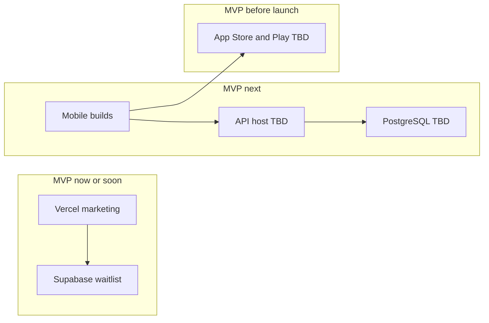

# Olimpia — Deployment Plan (Planning)

**Status:** Planning document for implementation  
**Audience:** Founder, developers, Cursor agents  
**Source of truth:** [BuildPlan.md](./build/BuildPlan.md) · [Architecture.md](./architecture/Architecture.md)

---

## What this file is for

This document explains **where each part of Olimpia runs** (website, API, mobile apps, databases) and **in what order** to deploy them. It is written for someone who is not a developer but needs to coordinate launches with engineers or Cursor.

**This is not app code.** Use it as a checklist when going from “works on my computer” to “live for users.”

---

## MVP scope reminder

### Three surfaces in MVP

| Surface | Technology | Where it deploys |
|---------|------------|------------------|
| **Marketing website** | TanStack Start + Vite + Nitro | **Vercel** |
| **Mobile app** | React Native (iOS + Android) | **App Store + Google Play** |
| **Backend API** | Node.js | **TBD** cloud host |

### Supporting services

| Service | Purpose | MVP |
|---------|---------|-----|
| **Supabase** | Marketing waitlist table | Yes (live pattern today) |
| **PostgreSQL** | Main app database | Yes — **TBD** host |
| **Privy, Bridge, Gnosis, Aave, Resend, LI.FI, Base** | Provider sandboxes → production | Phased by BuildPlan |

### Out of MVP deployment scope

- **Pia AI coach API** — no Anthropic integration deploy in MVP
- Push notification services (FCM/APNs)
- Admin dashboard hosting
- CMS or blog infrastructure

> Marketing may show a **static Pia section** on the homepage. That is front-end content only — no Pia server deployment in MVP.

---

## What exists today vs what is next

| Component | Status | Notes |
|-----------|--------|-------|
| Marketing site code | **Built** — runs locally | `npm run dev:marketing` → port 3000 |
| Marketing production deploy | **Ready to configure** | Vercel + `nitro: true` in vite config |
| Waitlist | **Works with Supabase env vars** | See [EnvironmentVariables.md](./EnvironmentVariables.md) |
| API (`apps/api`) | **Scaffold only** | No server deployed |
| Mobile (`apps/mobile`) | **Scaffold only** | No store builds |
| Main PostgreSQL | **Not provisioned** | Phase 0 |

---

## Deployment flow (big picture)

---

## Phase-by-phase deployment (MVP)

Mapped to [BuildPlan.md](./build/BuildPlan.md). **Pia Phase 7 is Future — not listed here.**

| Phase | Name | Deploy / provision | Done when |
|-------|------|-------------------|-----------|
| **0** | Foundation | Staging API host + PostgreSQL + health check | `GET /health` returns 200 on staging URL **TBD** |
| **1** | Marketing website | Vercel production + Supabase waitlist | Site live; waitlist signup stores email |
| **2** | Auth and shell | Mobile builds to TestFlight / internal testing **TBD** | Login works against staging API |
| **3** | Dashboard | Same staging stack | Balance and activity visible (test data OK) |
| **4** | Add money | Bridge sandbox webhooks → staging API | Deposit flow completes in sandbox |
| **5** | Savings goals | No new hosts | Goals work on staging |
| **6** | Send and receive | No new hosts | P2P between test users on staging |
| **8** | Growth account | Aave on Base (sandbox) | Growth deposit/withdraw on staging |
| **9** | Withdraw and card | Gnosis sandbox | Off-ramp + virtual card on staging |
| **10** | Release | Production API + production providers + store submission | Apps submitted; marketing on production domain |

---

## Marketing website on Vercel (detailed checklist)

### Vercel project settings

| Setting | Value |
|---------|-------|
| **Root Directory** | `apps/marketing` |
| **Framework Preset** | TanStack Start (or auto-detected) |
| **Build Command** | `npm run build` |
| **Install Command** | Default (`npm install` from repo root) |
| **Output Directory** | `dist` (Vercel preset — expected) |

### Environment variables (Production + Preview)

Set in Vercel → Settings → Environment Variables:

- `VITE_SUPABASE_URL`
- `VITE_SUPABASE_ANON_KEY`
- `VITE_SITE_URL` — **TBD** production URL
- `VITE_SUPPORT_EMAIL` — **TBD**

See [EnvironmentVariables.md](./EnvironmentVariables.md).

### Supabase (separate from Vercel)

1. Create Supabase project — **TBD** which project is production
2. Run SQL from [waitlist_emails.sql](../apps/marketing/supabase/waitlist_emails.sql)
3. Confirm RLS: anon can **insert only**, not read

### Domain (TBD)

- Point `olimpia.app` DNS to Vercel — **TBD**
- Enable HTTPS (automatic on Vercel)

### Post-deploy smoke test

- [ ] Homepage loads
- [ ] Waitlist modal accepts email
- [ ] `/privacy` and `/terms` load
- [ ] `robots.txt` and `sitemap.xml` reachable
- [ ] No secrets visible in browser devtools (only anon Supabase key)

---

## API deployment (TBD template)

Host choice is **TBD**. Candidates: Railway, Fly.io, Render, AWS ECS, etc.

### Requirements

- HTTPS public URL (providers need webhook callbacks)
- PostgreSQL reachable from API
- Environment secrets configured on host
- Long-running process (not static hosting)

### Webhook URLs (pattern)

Replace `{api-host}` with staging then production URL:

| Provider | Path |
|----------|------|
| Bridge | `https://{api-host}/api/v1/webhooks/bridge` |
| Gnosis Pay | `https://{api-host}/api/v1/webhooks/gnosis-pay` |
| Yield | `https://{api-host}/api/v1/webhooks/yield` **TBD** |

Register these URLs in each provider’s sandbox dashboard when that phase starts.

### Database migrations

- Run migrations against staging PostgreSQL before pointing mobile builds at staging
- Backup before production migrations — process **TBD**

---

## Mobile app release (high level)

| Step | Notes |
|------|-------|
| Apple Developer account | **TBD** |
| Google Play Console account | **TBD** |
| Bundle IDs / application IDs | **TBD** |
| Privy app configured for iOS + Android | Phase 2 |
| Internal testing | TestFlight (iOS) + internal track (Android) **TBD** |
| Store submission | Phase 10 — after staging walkthrough |

Mobile apps connect to **API_BASE_URL** — staging first, production at launch.

---

## Environments summary

| Environment | Marketing | API | Mobile | Providers |
|-------------|-----------|-----|--------|-----------|
| **Local** | localhost:3000 | localhost **TBD** | Simulators | Optional sandboxes |
| **Staging** | Vercel preview or staging domain **TBD** | **TBD** URL | TestFlight / internal | Sandboxes |
| **Production** | olimpia.app **TBD** | **TBD** URL | App Store + Play | Production keys **TBD** |

---

## Rollback and safety

| Surface | Rollback approach |
|---------|-----------------|
| Marketing (Vercel) | Redeploy previous deployment in Vercel dashboard |
| API | Redeploy previous container/image — **TBD** host feature |
| Database | Restore from backup — backup schedule **TBD** |
| Mobile | Cannot rollback users already on store; ship fix forward |

---

## Future — Pia deployment (not MVP)

When Pia is approved later:

- Deploy Anthropic API access on **API server only** (`ANTHROPIC_API_KEY`)
- Add `/pia/*` routes — no marketing or mobile key exposure
- No separate Pia microservice required for first version (backend module only)

---

## Decisions still TBD

| Topic | Notes |
|-------|-------|
| API hosting provider | Blocks staging URL and webhook registration |
| Production PostgreSQL host | Supabase vs dedicated |
| Production domain DNS | `olimpia.app` |
| Staging vs production Supabase projects | One or two projects |
| Apple / Google developer accounts | Required before Phase 10 |
| Min iOS / Android versions | **TBD** |

---

## Related documents

- [EnvironmentVariables.md](./EnvironmentVariables.md) — what to configure on each host
- [DatabaseSchema.md](./DatabaseSchema.md) — what PostgreSQL must exist before API deploy
- [TestingChecklist.md](./TestingChecklist.md) — verify after each deploy
