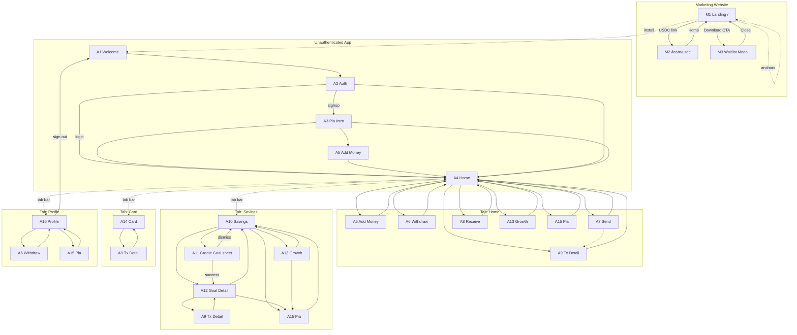

# Olimpia — Navigation Map

**Version:** 1.0  
**Status:** Draft for validation  
**Purpose:** Validate navigation before development — no UI designs, no code  
**Source of truth:** [PRD.md](./PRD.md) · [Brand.md](../brand/Brand.md) · [Architecture.md](../architecture/Architecture.md) · [UserFlows.md](./UserFlows.md) · [BuildPlan.md](../build/BuildPlan.md) · [ScreenInventory.md](./ScreenInventory.md)

---

## Validation scope

| Surface set | IDs | Count |
|-------------|-----|-------|
| Marketing | M1–M3 | 3 |
| Mobile app | A1–A16 | 16 |
| **Total navigable surfaces** | | **19** |

**Out of scope for this map:** `llms.txt` (static file) · FAQ (`#faq` section on M1) · Settings (merged into A16) · inline async states (same route).

---

## Navigation model (mobile)

| Rule | Behavior |
|------|----------|
| **Tab bar** | 4 persistent tabs: Home · Savings · Card · Profile |
| **Per-tab stack** | Each tab owns a navigation stack; switching tabs preserves each tab's stack state |
| **Back (header)** | Pops one level within the **current tab's stack** |
| **Active tab tap** | Pops current tab stack to tab root (A4, A10, A14, or A16) |
| **Modal / sheet** | Overlays current screen; dismiss returns to **presenting screen** |
| **Onboarding** | Pre-auth stack outside tabs: A1 → A2 → (A3) → tabs |
| **Sign out** | Clears session; resets to A1 Welcome (tabs unmounted) |
| **Pia (A15)** | Pushed on **caller's tab stack**; back returns to entry screen on that tab |

---

## Screen navigation reference

### Marketing

#### M1 — Landing Page (`/`)

| Field | Detail |
|-------|--------|
| **Parent** | None (site root) |
| **Children** | M2 (route) · M3 (modal) · in-page anchors (`#features`, `#how-it-works`, `#faq`, `#preview`, `#pia`, `#real-life`, `#infrastructure`) |
| **Entry points** | Direct URL · search · social · referral |
| **Exit points** | M2 · M3 · anchor scroll · external store links · footer legal/support |
| **Back behavior** | Browser back from M2 → M1; anchor scroll has no stack |
| **Tab behavior** | N/A (marketing) |

#### M2 — What is USDC (`/learn/usdc`)

| Field | Detail |
|-------|--------|
| **Parent** | M1 (logical); browser history |
| **Children** | None |
| **Entry points** | M1 Hero USDC link · M1 FAQ links |
| **Exit points** | M1 (logo / home link) · M1 `#faq` · Download CTA → M3 |
| **Back behavior** | Browser back → M1 |
| **Tab behavior** | N/A |

#### M3 — Waitlist Modal

| Field | Detail |
|-------|--------|
| **Parent** | M1 (overlay) |
| **Children** | None |
| **Entry points** | M1 Hero Download · M1 nav Download/Waitlist · M1 final CTA |
| **Exit points** | Close → M1 (same scroll position) · success dismiss → M1 |
| **Back behavior** | Close button / overlay tap (if enabled) → M1 |
| **Tab behavior** | N/A |

---

### Mobile — unauthenticated

#### A1 — Welcome

| Field | Detail |
|-------|--------|
| **Parent** | None (app root when logged out) |
| **Children** | A2 |
| **Entry points** | Cold start (no session) · A16 sign out |
| **Exit points** | Create account → A2 (signup) · Sign in → A2 (login) |
| **Back behavior** | None on cold start; after sign-out, no back to authenticated tabs |
| **Tab behavior** | Tabs hidden |

#### A2 — Authentication (Privy)

| Field | Detail |
|-------|--------|
| **Parent** | A1 |
| **Children** | A3 (signup only) · A4 (login) · A5 (signup + add money path) |
| **Entry points** | A1 |
| **Exit points** | Signup success → A3 · Login success → A4 · Sync error → retry on A2 |
| **Back behavior** | Back → A1 |
| **Tab behavior** | Tabs hidden |

#### A3 — Pia Introduction

| Field | Detail |
|-------|--------|
| **Parent** | A2 (signup path only) |
| **Children** | A4 · A5 |
| **Entry points** | A2 after first registration (**skipped on login**) |
| **Exit points** | Continue → A4 · Add money now → A5 · Explore → A4 |
| **Back behavior** | Back → A2 (discouraged but allowed) or non-skippable forward-only per product choice at implementation |
| **Tab behavior** | Tabs hidden until A4 reached |

---

### Mobile — authenticated (by tab)

#### A4 — Home Dashboard · **Tab: Home**

| Field | Detail |
|-------|--------|
| **Parent** | Tab root (Home stack) · A2/A3 onboarding |
| **Children** | A5 · A6 · A7 · A8 · A9 · A13 · A15 |
| **Entry points** | Onboarding/login complete · Home tab tap · Back from Home-stack children |
| **Exit points** | Quick actions → A5 · A7 · A8 · A15 · Activity → A9 · Growth CTA → A13 · Withdraw (secondary) → A6 · Tabs → A10 · A14 · A16 |
| **Back behavior** | N/A at root; system back on Android at root → background app |
| **Tab behavior** | Home tab selected; re-tap Home → stay at A4 (stack cleared if nested) |

*Primary quick actions (PRD): Add · Send · Receive · Ask Pia. Withdraw is **not** in the quick-action row — entry via Profile (primary) or secondary Home affordance (Architecture §7).*

#### A5 — Add Money · **Tab: Home stack** (or onboarding pre-tabs)

| Field | Detail |
|-------|--------|
| **Parent** | A4 · A3 (add money now) |
| **Children** | None (inline states only) |
| **Entry points** | A4 Add · A3 fund-now |
| **Exit points** | Success/dismiss/cancel → A4 |
| **Back behavior** | Back → A4 (confirm if mid-flow) |
| **Tab behavior** | Other tabs accessible; switching tab preserves Home stack with A5 open |

#### A6 — Withdraw Money · **Tab: Home or Profile stack**

| Field | Detail |
|-------|--------|
| **Parent** | A4 (secondary) · A16 (primary) |
| **Children** | None (inline states); error path may link to A12/A13 |
| **Entry points** | A16 Profile · A4 secondary/menu (Architecture) |
| **Exit points** | Success → presenting tab root (A4 or A16) · Error insufficient → user may navigate to A12/A13 via tabs |
| **Back behavior** | Back → A4 or A16 (presenting screen) |
| **Tab behavior** | Open on stack of entry tab |

#### A7 — Send Money · **Tab: Home stack**

| Field | Detail |
|-------|--------|
| **Parent** | A4 |
| **Children** | A9 (optional on success) |
| **Entry points** | A4 Send |
| **Exit points** | Success → A4 or A9 · Cancel → A4 |
| **Back behavior** | Back → previous step or A4 |
| **Tab behavior** | Home stack |

#### A8 — Receive Money · **Tab: Home stack**

| Field | Detail |
|-------|--------|
| **Parent** | A4 |
| **Children** | OS share sheet (external) |
| **Entry points** | A4 Receive |
| **Exit points** | Dismiss → A4 · Share sheet → returns to A8 or A4 |
| **Back behavior** | Back → A4 |
| **Tab behavior** | Home stack |

#### A9 — Transaction Detail · **Tab: caller stack**

| Field | Detail |
|-------|--------|
| **Parent** | A4 · A12 · A14 · A7 (optional) |
| **Children** | None |
| **Entry points** | Activity/spend row on A4 · A12 · A14 · A7 success |
| **Exit points** | Back only |
| **Back behavior** | Back → exact parent screen |
| **Tab behavior** | Stays on stack of originating tab |

#### A10 — Savings Goals · **Tab: Savings**

| Field | Detail |
|-------|--------|
| **Parent** | Tab root (Savings stack) |
| **Children** | A11 (sheet) · A12 · A13 · A15 |
| **Entry points** | Savings tab · Back from Savings-stack children |
| **Exit points** | Goal row → A12 · New Goal → A11 · Growth → A13 · Ask Pia → A15 · Tabs |
| **Back behavior** | N/A at root |
| **Tab behavior** | Savings tab root |

#### A11 — Create Goal · **Sheet on Savings tab**

| Field | Detail |
|-------|--------|
| **Parent** | A10 (presenting) |
| **Children** | A12 (on success) |
| **Entry points** | A10 New Goal |
| **Exit points** | Success → A12 (pushed on Savings stack) · Dismiss → A10 |
| **Back behavior** | Swipe down / Cancel → A10 |
| **Tab behavior** | Sheet blocks interaction with A10; tabs dimmed or disabled while sheet open |

#### A12 — Goal Detail · **Tab: Savings stack**

| Field | Detail |
|-------|--------|
| **Parent** | A10 · A11 |
| **Children** | A9 · A15 |
| **Entry points** | A10 goal row · A11 success |
| **Exit points** | Back → A10 · Activity → A9 · Ask Pia → A15 |
| **Back behavior** | Back → A10 |
| **Tab behavior** | Savings stack |

#### A13 — Growth Account · **Tab: Home or Savings stack**

| Field | Detail |
|-------|--------|
| **Parent** | A4 · A10 |
| **Children** | A15 |
| **Entry points** | A10 Growth link · A4 growth summary/CTA |
| **Exit points** | Back → A4 or A10 · Ask Pia → A15 |
| **Back behavior** | Back → entry parent (A4 or A10) |
| **Tab behavior** | Stack of tab used to enter |

#### A14 — Virtual Debit Card · **Tab: Card**

| Field | Detail |
|-------|--------|
| **Parent** | Tab root (Card stack) |
| **Children** | A9 · CVV reveal (inline/modal on A14) |
| **Entry points** | Card tab |
| **Exit points** | Spend row → A9 · Tabs |
| **Back behavior** | N/A at root |
| **Tab behavior** | Card tab root; card management (freeze, CVV) on this screen — no separate screen |

#### A15 — Pia AI Chat · **Tab: caller stack**

| Field | Detail |
|-------|--------|
| **Parent** | A4 · A10 · A12 · A13 · A16 |
| **Children** | None |
| **Entry points** | Ask Pia from Home · Savings · Goal Detail · Growth · Profile |
| **Exit points** | Back → parent · Tab switch → other tab root (conversation persisted) |
| **Back behavior** | Back → entry screen on same tab |
| **Tab behavior** | Lives on stack of tab that opened it; switching away preserves Pia stack until back or tab-root reset |

#### A16 — Profile · **Tab: Profile**

| Field | Detail |
|-------|--------|
| **Parent** | Tab root (Profile stack) |
| **Children** | A6 · A15 · sign out → A1 |
| **Entry points** | Profile tab |
| **Exit points** | Withdraw → A6 · Ask Pia → A15 · Sign out → A1 · Tabs |
| **Back behavior** | N/A at root |
| **Tab behavior** | Profile tab root; **Settings merged here** — no A17 |

---

## 1. Marketing website navigation

Single-page primary experience (M1) with one secondary route (M2) and one modal (M3).

```
[M1 Landing /]
    │
    ├── Nav anchors (same page)
    │     ├── #features
    │     ├── #how-it-works
    │     └── #faq
    │
    ├── Hero / CTAs
    │     ├── USDC text ──────────► [M2 /learn/usdc]
    │     ├── Download ───────────► [M3 Waitlist modal]
    │     └── Learn More ─────────► #features
    │
    ├── Sections (scroll): preview · real-life · pia · infrastructure · features · how-it-works · faq · final-cta
    │
    ├── Footer ──► stores · support · privacy · terms
    │
    └── [M3 Waitlist] ── close ──► M1

[M2 /learn/usdc] ── back/home ──► [M1]
```

**No authenticated marketing nav.** No hamburger-heavy IA (PRD §12).

---

## 2. Mobile app navigation

```
[Unauthenticated]
    A1 Welcome ──► A2 Auth ──┬── signup ──► A3 Pia intro ──► A4 Home (tabs)
                             │                    └──► A5 Add Money ──► A4
                             └── login ─────────────────────────────► A4 Home (tabs)

[Authenticated — 4 tabs]
    Home(A4) │ Savings(A10) │ Card(A14) │ Profile(A16)
```

Cross-tab navigation is **only via tab bar** — no cross-tab stack jumps except tab switch.

---

## 3. Onboarding navigation

| Step | Surface | Next | Back |
|------|---------|------|------|
| 1 | A1 Welcome | A2 | — |
| 2 | A2 Auth | A3 (signup) or A4 (login) | A1 |
| 3 | A3 Pia intro | A4 or A5 | A2 |
| 4 | A4 Home or A5 Add Money | Tabs available | — |

**Login path:** A1 → A2 → A4 (skips A3).

**Time target:** Home within ~3 minutes (PRD).

---

## 4. Authenticated user navigation

Default resting state: **A4 Home** (or last-used tab).

| From | Can reach |
|------|-----------|
| **A4 Home** | A5 · A6* · A7 · A8 · A9 · A13 · A15 · any tab |
| **A10 Savings** | A11 · A12 · A13 · A15 · A9 · any tab |
| **A14 Card** | A9 · any tab |
| **A16 Profile** | A6 · A15 · A1 (sign out) · any tab |

*A6 from A4 = secondary entry only (not primary quick-action row).

Money flows return to **tab root or parent** on success — not orphaned success screens.

---

## 5. Bottom tab navigation

| Tab | Root | Stack children (typical) |
|-----|------|--------------------------|
| **Home** | A4 | A5 · A6 · A7 · A8 · A9 · A13 · A15 |
| **Savings** | A10 | A11 (sheet) · A12 · A13 · A9 · A15 |
| **Card** | A14 | A9 |
| **Profile** | A16 | A6 · A15 |

| Interaction | Result |
|-------------|--------|
| Tap different tab | Show that tab's stack (preserved) |
| Tap same tab again | Pop to tab root |
| Tab visible during stack | Always (except full-screen Bridge WebView — implementation detail) |

**Avoided (PRD):** 5th tab · hamburger for core destinations · Crypto/Invest tab.

---

## 6. Modal and sheet navigation

| Surface | Type | Presenter | Dismiss → |
|---------|------|-----------|-----------|
| **M3** Waitlist | Modal | M1 | M1 |
| **A11** Create Goal | Bottom sheet | A10 | A10 (cancel) or A12 (success) |
| **A3** Pia intro | Card/modal | A2 | A4 / A5 |
| **CVV reveal** | Inline/modal | A14 | A14 |
| **Send success** | Inline/modal | A7 | A4 or A9 |
| **Bridge funding** | WebView/modal | A5 | A5 (inline state) |

Sheets/modals **do not** appear in tab bar. Dismiss always returns to presenter unless success explicitly navigates (A11 → A12).

---

## 7. Deep links

| Link type | MVP status | Target | Source |
|-----------|------------|--------|--------|
| **Receive / referral** | **Optional** (Architecture §3B) | A8 Receive or A4 Home | Universal links / app links — PRD §18 open question |
| **App Store / Play** | MVP (marketing) | Store listing → install → A1 | M1 footer / M3 |
| **Marketing `/learn/usdc`** | MVP | M2 | HTTPS route |
| **Email magic links** | Privy auth | A2 | Privy SDK (not custom) |

**If receive deep link deferred:** User installs app → A1 → A2 → A4 → manual Receive (A8). Document in store listing.

**Not MVP:** Request-money deep links · joint account invites · push notification deep routes.

---

## 8. Error recovery navigation

| Error context | User stays on | Recovery actions | Exit |
|---------------|---------------|------------------|------|
| **Deposit failed (A5)** | A5 inline | Retry · support link | Back → A4 |
| **Withdraw failed (A6)** | A6 inline | Retry · support | Back → A4/A16 |
| **Insufficient available (A6)** | A6 | Message + link to free funds → user switches tab to A12/A13 | Manual |
| **Send failed (A7)** | A7 inline | Retry · support | Back → A4 |
| **Growth deposit/withdraw failed (A13)** | A13 inline | Retry · support | Back → A4/A10 |
| **Card declined** | A14 activity / A9 | View detail; no trap | A9 back → A14 |
| **Balance/activity load fail (A4)** | A4 | Pull-to-refresh / retry | Tabs still available |
| **Pia timeout (A15)** | A15 | Retry send | Back → parent |
| **Auth/sync fail (A2)** | A2 | Retry · support | Back → A1 |
| **Waitlist fail (M3)** | M3 | Retry · support | Close → M1 |

**Global:** No dead-end error screens without **Back**, **Retry**, or **support** path (Architecture §21).

---

## 9. Empty state navigation

| Surface | Empty condition | CTA navigation |
|---------|-----------------|----------------|
| **A4 Home** | New user · $0 balance | → A5 Add Money · → A10/A11 Create Goal |
| **A4 Home** | No activity yet | → A5 · → A7 · → A8 |
| **A10 Savings** | No goals | → A11 Create Goal sheet |
| **A12 Goal Detail** | $0 allocated | Inline add funds (stay on A12) |
| **A13 Growth** | $0 in growth | Inline grow action (stay on A13); needs available balance → A5 if empty |
| **A14 Card** | No spends yet | Card still usable; → A5 if no balance |
| **A15 Pia** | No chat history | Suggested prompt chips (stay on A15) |
| **A6 Withdraw** | No linked bank | → stay on A6 with link/setup copy toward Profile/Bridge |

Empty states **always offer a forward path** — never a visual dead end.

---

## User journey maps

### New user journey

```
M1 (optional discover) → Store install
  → A1 Welcome → A2 Auth (signup)
  → A3 Pia intro
  → A4 Home [empty state]
      ├─► A5 Add Money (first deposit journey)
      ├─► A10 → A11 → A12 (first goal journey)
      └─► A15 Pia (first conversation)
```

### Returning user journey

```
App open (session valid)
  → A4 Home [populated dashboard]
      ├─► Quick action (A5/A7/A8/A15)
      ├─► A9 from activity
      └─► Tab switch (A10/A14/A16)
```

Login path: A1 → A2 (login) → A4 (no A3).

### First deposit journey

```
A4 [empty/prompt] or A3 [add money now]
  → A5 Add Money
      → amount + method + review + confirm
      → inline processing
      → success → A4 [updated balance + activity]
```

### First goal journey

```
A4 [empty CTA] or A10 [empty list]
  → A11 Create Goal sheet
      → name + target + optional allocate
      → success → A12 Goal Detail
      → optional: add funds inline on A12
      → Back → A10
```

### First growth journey

```
A4 [growth CTA] or A10 [growth entry]
  → A13 Growth Account
      → read headline copy
      → deposit inline flow
      → success → A13 [balance in growth]
      → Back → A4 or A10
```

Requires available balance (often after first deposit).

### First Pia conversation journey

```
A4 Ask Pia (or A10/A12/A13/A16)
  → A15 Pia Chat
      → disclaimer + suggested prompts
      → user message → Pia reply
      → Back → entry screen (e.g. A4)
```

Preceded optionally by **A3 Pia intro** at signup (not a chat session).

---

## Visual navigation tree (Mermaid)



---

## Navigation audit

### Orphan screens

| ID | Status |
|----|--------|
| M1–M3 | ✅ All reachable from web entry |
| A1–A16 | ✅ All reachable from cold start, tabs, or sign out loop |
| **None identified** | Every inventory surface has ≥1 entry path |

### Dead ends

| Location | Risk | Mitigation (documented) |
|----------|------|-------------------------|
| M3 success | Low | Close → M1 |
| A5/A6/A7/A13 failed | Low | Retry + back + support |
| A8 after share | Low | Dismiss → A4 |
| A15 rate limit | Low | Retry message + back |
| Bridge WebView | Med | User must complete or cancel back to A5 — implement cancel |

**No screen lacks an exit** except transient provider WebView (A5) — requires explicit cancel.

### Duplicate navigation paths

| Pattern | Paths | Assessment |
|---------|-------|--------------|
| **Ask Pia → A15** | A4 · A10 · A12 · A13 · A16 | ✅ Intentional — context-aware entry |
| **A13 Growth** | A4 · A10 | ✅ Intentional — two valid entry points |
| **A6 Withdraw** | A4 · A16 | ✅ Intentional — Profile primary |
| **A9 Transaction Detail** | A4 · A12 · A14 · A7 | ✅ Intentional — shared detail screen |
| **Add Money** | A4 · A3 | ✅ Onboarding + home |

**No duplicate screens** — duplicates are **entry points** only (acceptable).

### Unnecessary navigation complexity

| Item | Severity | Notes |
|------|----------|-------|
| A13 on two tab stacks | Low | Same surface, two parents — document stack context for back |
| A15 on five entry points | Low | Single A15 screen — back resolves correctly |
| 4 tabs + deep stacks | Low | Within PRD limits; no 5th tab |

**Overall:** Complexity matches MVP scope; no reduction recommended without scope change.

### Missing back navigation

| Surface | Back | Status |
|---------|------|--------|
| Tab roots (A4/A10/A14/A16) | N/A | ✅ |
| All stack screens | → parent | ✅ Specified |
| A11 sheet | swipe/cancel | ✅ |
| M3 modal | close | ✅ |
| A3 intro | product choice | ⚠️ **Founder decision:** allow back to A2 or forward-only? |

### Potential UX friction — founder attention

| # | Friction | Recommendation |
|---|----------|----------------|
| 1 | **Withdraw discoverability** | PRD quick actions omit Withdraw; Architecture allows Home **secondary** entry. **Recommend:** Withdraw prominent on A16 Profile; optional Home overflow/menu — confirm at implementation. |
| 2 | **A13 Growth entry from two tabs** | Back must return to correct parent (A4 vs A10). Implement stack-per-tab carefully. |
| 3 | **Insufficient funds for withdraw** | A6 error references freeing goal/growth funds but navigation is manual via tabs — consider inline links to A12/A13 (copy only; no new screens). |
| 4 | **Receive deep links optional** | Without deep links, new payers must find Receive manually — acceptable for MVP if documented. |
| 5 | **A11 success → A12** | User may not know how to return to A10 — back from A12 handles; OK. |
| 6 | **Pia on multiple stacks** | Tab switch while in A15 may confuse — persist thread; back returns to entry. QA on iOS + Android. |
| 7 | ~~**Brand.md Pia section**~~ | **Resolved:** Marketing = static Pia preview; app = live Pia MVP. Brand.md updated. |

---

## Validation checklist

- [ ] All 19 surfaces mapped with parent/child/entry/exit/back/tab
- [ ] Bottom tab model matches PRD §12
- [ ] Onboarding path matches UserFlows §2–§3
- [ ] Withdraw: Profile primary, Home secondary — confirmed
- [ ] No separate Settings or Card Management screens
- [ ] A11 documented as sheet
- [ ] Deep links marked optional per Architecture
- [ ] Error and empty states have forward/recovery paths
- [ ] Navigation audit reviewed by founder

---

## Document flow

```
PRD.md → Brand.md → Architecture.md → UserFlows.md → BuildPlan.md → ScreenInventory.md → NavigationMap.md (this document) → Implementation
```

---

*End of NavigationMap.md v1.0*
